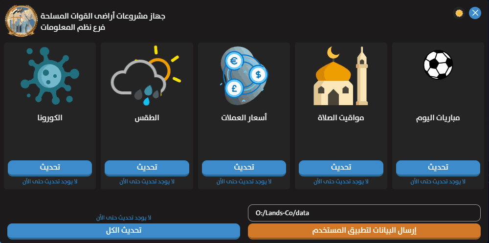

  
  <h3 align="center">Lands-Co Collector</h3>
  <h4 align="center">For Armed Forces Land Projects Authority</h4>
  

    <strong>Lands-Co Collector</strong> is a data collector program that collects corona, football, prayer times, today currencies price,
  and weather data from trusted sources and APIs as JSON files and sends them to the <a href="https://github.com/MahmoudSharaf55/Lands-Co">Lands-Co</a> program for users to see.
     
     
    <a href="https://github.com/MahmoudSharaf55/Lands-Co-Collector/issues/new">Have a bug</a>
    &nbsp~&nbsp
    <a href="https://github.com/MahmoudSharaf55/Lands-Co-Collector/issues/new">Have a new feature</a>
     

  

## 📱 Screenshots

 

## ✨ Features

|             **Features**           |
| :---------------------------------------------------- |
| Automatically detect network connection state |
| Light & Dark Mode |
| Awesome user interface |

## 🛠️ Technologies

* Node.js 16.13.1
* Electron 13.1.2

## ℹ Requirements

* Network connection to get data.

## 🚩 License

## 💻 Authors

[**Ma7MOoOD SHaRaF**](https://github.com/MahmoudSharaf55)

 

> **Thanks ❤️**
